 #  Portfolio in AI/ML/Computer Vision 

---

Hello, guys! I'm a Scientist and Engineer in Machine Learning and Computational Science. Fire off an email to: 77777aidan@gmail.com

## Project 1: AI Agent Doctor with RAG based on Verified Scientific Data using n8n.   
Here, I create AI Doctor Agent (chatbot) that uses only scientifically verified data from British Healthcare (NHS) website using n8n for rapid prototyping of AI agents. It is providing 24/7 access to reliable medical information for questions about symptoms and conditions, helping healthcare professionals, patients and students quickly reference medical guidelines and protocols. 

Step 1: Scraping website for information about illnesses - This part starts by scraping the British official NHS website for information about illnesses, which lists various medical conditions and their links. Finally, all the processed data - the text, illness names, and embeddings - gets stored in a PostgreSQL database with special vector search capabilities.

 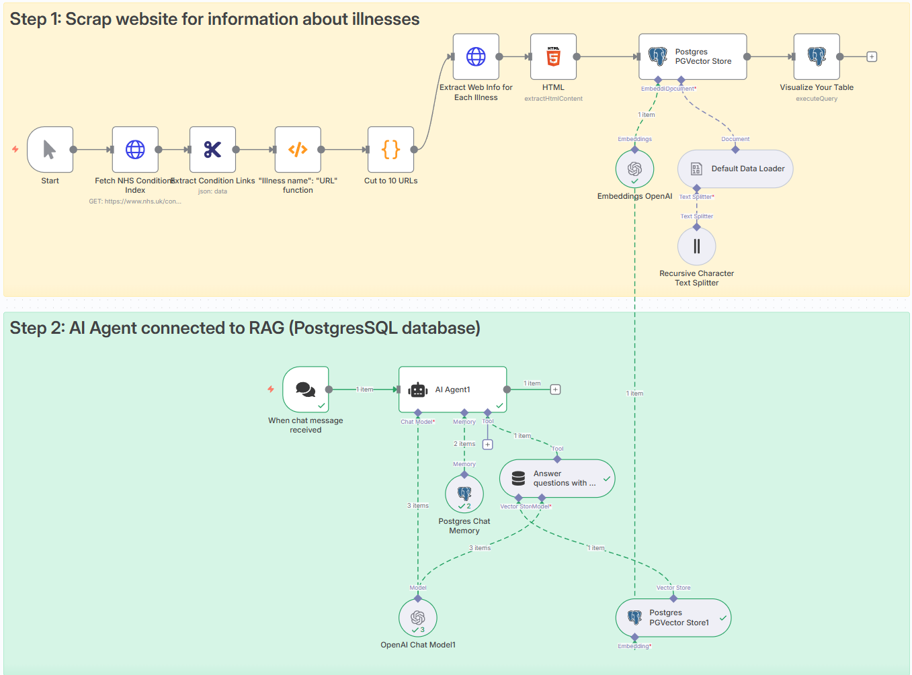 

Step 2: AI Agent connected to RAG (PostgreSQL database) - This second part creates a chat interface where users can ask medical questions. When someone sends a message, an AI agent powered by OpenAI receives it and uses a technique called RAG (Retrieval Augmented Generation). The agent searches through the database of NHS medical information stored earlier, finding the most relevant content about the user's question using vector similarity search. It also maintains conversation history in the same PostgreSQL database, so it can remember what was discussed earlier in the chat. The AI then combines the retrieved medical information with its general knowledge to provide accurate, contextual answers about health conditions, essentially creating a knowledgeable medical assistant that bases its responses on official NHS information rather than just general AI training data.

**Technologies:** n8n, Web Scraping, PostgreSQL, OpenAI

## Project 3: Multi-Modal Vision-Language Transformers for Automated Radiology Report Generation from X-ray Images

I trained (fine-tuned) a multi-modal LLM model to predict the findings on X-ray images to help radiologists in their day-to-day work. 
The present global shortage of radiologists limits access to specialist care and imposes heavy workloads on radiologists, leading to unwanted delays and errors in clinical decisions.
This model can automate X-ray report generation, enhance diagnostic accuracy, and facilitate clinicians in providing timely and effective patient care.

Unfortunately, generating radiology reports remains an unsolved challenge. Here, I present an approach to tackle this challenge and showcase the use of Vision-Language LLM to predict radiology reports. The model inputs multi-modal image and text data and provides an X-ray report. I use the Llama 3.2-Vision and Qwen2-VL models and fine-tune them on the 2900+ chest X-ray images from the public [IU X-Ray dataset](https://paperswithcode.com/dataset/iu-x-ray). 

 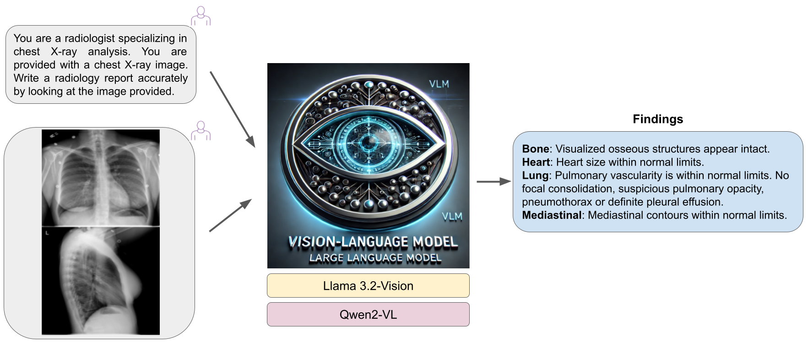 

For the model performance evaluation of the clinical quality of artificial intelligence (AI)-generated reports, I use the GREEN (Generative Radiology Report Evaluation and Error Notation) metric. 
It utilizes language models to identify and explain clinically significant errors in radiology reports. 
Other evaluation metrics can also be used, but they either fail to consider factual correctness, such as BLEU and ROUGE or have limited interpretability, like F1CheXpert and F1RadGraph ([Ostmeier et al., 2024](https://stanford-aimi.github.io/green.html)).
I get the following distribution of GREEN scores evaluated on the per report sample image: 

 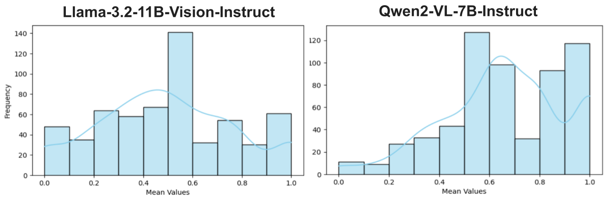 

GREEN uses advanced language models to:
	
 -	Compare a machine-generated radiology report to a trusted, expert-written reference report.
 -	Spot clinically important mistakes-for example, if the AI says “no pneumonia” when there actually is pneumonia.
 -	Explain the errors in plain language, so users know exactly what went wrong and why.

**Technologies:** LLMs, VLMs, Torch, Unsloth 

## Project 4: AI agent for job search using LangChain

An AI agent is a specialized software solution built on top of large language models (LLMs) and fine-tuned to automate specific, critical tasks across various industries. Examples include: 
- AI tax accountant that manages tax preparation and advisory services,
- AI medical biller that handles patient records and submits claims,
- AI phone support agent that responds to customer inquiries in real-time,
- AI compliance agent that ensures regulatory adherence, and an AI quality assurance tester that automates software testing processes. 

These agents enhance efficiency by focusing on niche areas, and providing accurate and effective solutions. Here, I have developed an AI agent capable of utilizing multiple tools for efficient job searching and company research. The agent leverages LangChain, OpenAI’s chat models, and external tools such as Google Jobs and Wikipedia search to retrieve structured information about job openings. A LangChain agent consists of various components, including chat LLM models, prompt templates, external tools, and other integrations.

I have implemented a ReAct agent (reason and act), which offers a more structured approach to building AI systems. The agent is provided with specific instructions, such as acting as a recruiter or an assistant, and generates responses based on user queries. By interacting with real-world data sources, it ensures dynamic and real-time functionality. The results demonstrate how the agent selects the appropriate tool—such as Wikipedia for answering company-related queries or Google Jobs for job searches—based on the prompt given to the LLM chat model.

 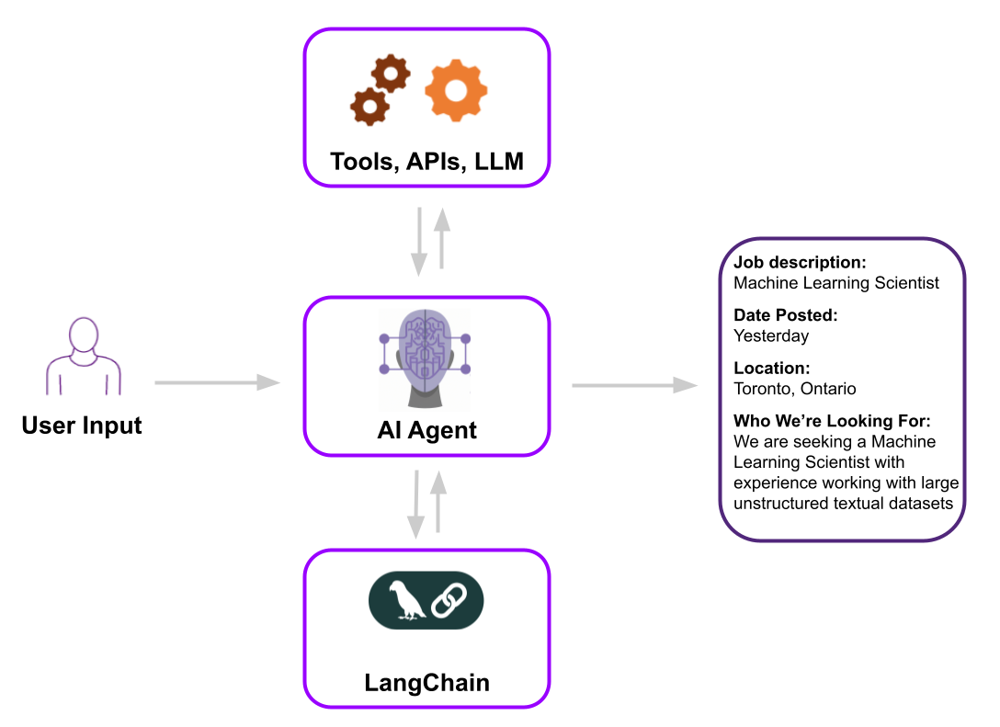 

## Project 5: Integrated ML Predictor of Clinical Trials for Drug Discovery
We have developed a method that employs Bayesian statistics to accurately forecast the outcomes of clinical trials in the course of novel drug development. The development of an oncology drug currently incurs a cost exceeding £4 billion, given the high failure rate of approximately 95%. Our proposed Digital Twin can simulate a clinical trial and predict novel drug outcomes, thereby improving and mitigating risks in the clinical development of oncology therapeutics. 
- It uses multi-modal data: genetics (like RNAseq), clinical, image data and chemical compounds data
- We integrate XGBoost, Gaussian Process and Survival Modelling into one model
- We validate our model against past clinical trials and use standard ML validation methods 

 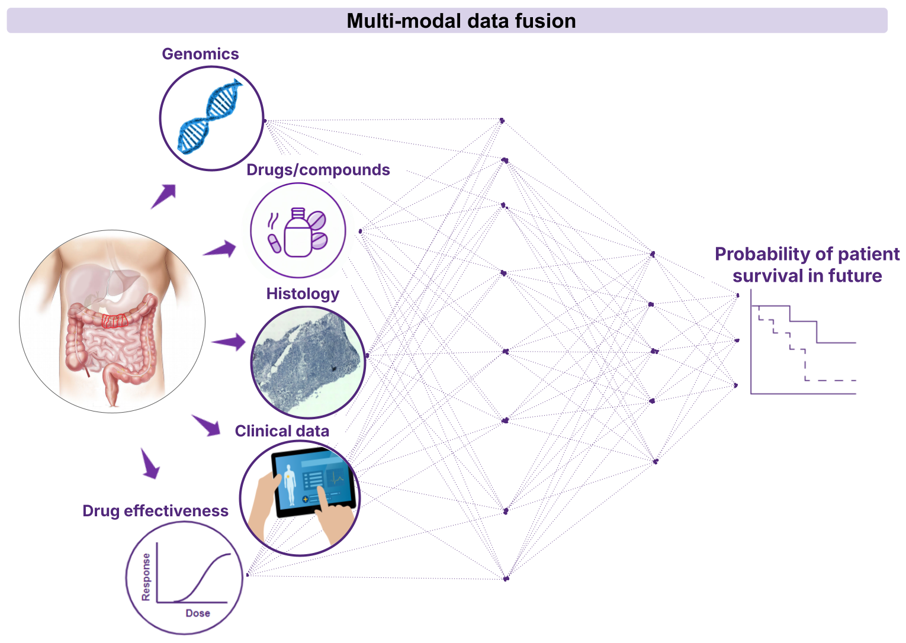 

We validate our model by comparing its outputs against the actual historical clinical trials blindly and un-blindly. We simulated digital twin trial arms for single chemotherapy drugs and combinations to predict treatment response. TCGA data was used as input, and treatment predictions were compared to the results of eight published historical phase 2 and phase 3 clinical studies (1997 - 2018), as these trials were assessable with the input data available. We compared the predicted log odds ratio (OR) generated by the digital twin model for Overall Response Rates (ORR) for each treatment arm tested in the clinical study, and then compared this against the reported log odds ratios (log OR) from the actual trial. We started with single-agent predictions, then progressively increased the complexity through combinations and heterogeneous treatments in more sophisticated clinical trial designs.

 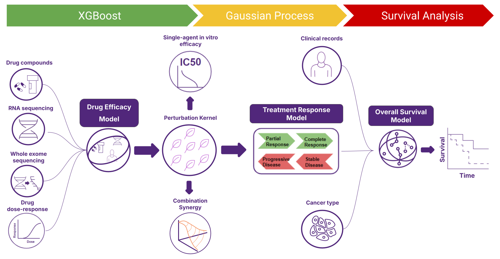 

The paper submitted to NEJM AI. I have an older preprint on the [MedRxiv](https://www.medrxiv.org/content/10.1101/2024.01.17.24301444v1), the newer and significantly better is being reviewed. Let me know if you'd like to receive the newer version.  

## Project 6: Computer Vision ML to Identify Cell Types on the Medical Images 
We developed a deep-learning model to identify types of cells (tumour cells, lymphocytes, and fibroblasts) from medical images. The model was utilized to investigate the impact of image features on the modelling of clinical trials for drug discovery and predicting treatment outcomes. Additionally, it could assist pathologists, who spend a considerable amount of time on diagnostics, by improving their productivity.

The model was trained with annotated images from a breast cancer dataset and validated using standard machine learning validations and by another expert pathologist. The results demonstrated that the model could accurately identify the cells, especially tumour-infiltrating lymphocytes (TILs), which it identified even more accurately than a pathologist.

 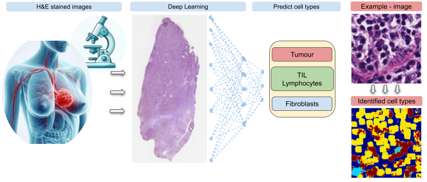 

We employed a U-Net architecture for semantic segmentation, training the model on the NuCLS dataset annotated for cell types. The dataset, comprising images from the TCGA for breast cancer, was split into training and validation/testing sets. The model's performance demonstrates promising results with an AUROC of 0.864 and 0.901, along with balanced and standard accuracies. The model offers a tool that can enhance precision treatment by integrating it into complex predictive modelling systems. 

We presented it at the [AACR conference](https://aacrjournals.org/cancerres/article/83/7_Supplement/5424/719634) in 2023, the poster is available to download [here](https://concr.co/news/he-tnbc). 

## Project 7: Hybrid “Deep Learning + Physics” Computer Vision Model

Here, I designed and created a deep learning model that combines computer vision deep learning and physics for the physics-based simulation. Solving multi-physics problems usually requires expensive, high-performance computers and complex code. The model helps and explores how machine learning can reduce computation time in these kinds of problems. It uses a deep learning model, specifically a convolutional neural network, to predict rough fracture permeability from digital images during the fracture deformation process. Even in extrapolation tests with different fracture roughness, the model maintained high accuracy with about 8% MAPE. I show that my method is able to speed up the numerical simulation up to 20 times faster than the conventional fully physics-based methods.

 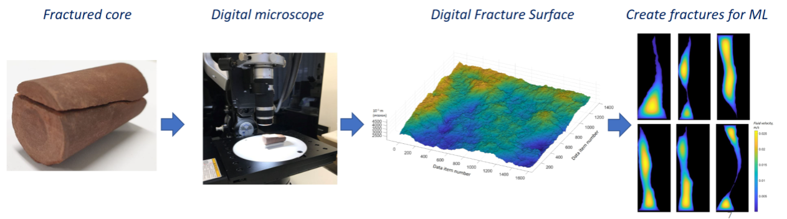 

I published it in the [Engineering Applications of Artificial Intelligence](https://www.sciencedirect.com/science/article/abs/pii/S0952197623007467) journal in 2023. 

## Project 8: Physics-based Computer Vision Method for Energy, Oil&Gas, Climate Change and Earthquakes projects

I created a research software tool (Physics-based Computer Vision Method) and methodology that takes digital images as inputs, performs predictive modelling, and identifies key performance indicators (KPIs) for energy, oil&gas and climate change projects. The model focuses on understanding and simulating how stress affects the permeability of rough fracture surfaces during the surface deformation process, using a combination of numerical contact mechanics, numerical modelling and the Stokes equation. This approach allows for the simulation of mechanical deformation and fluid flow in natural fractures with complex geometries. The software accurately predicts the stress-permeability relationship, helping to provide valuable insights for hydro-mechanical studies of geological formations. This tool significantly reduces computation time, providing quick and accurate results that can inform better decision-making in energy, oil&gas and climate change projects, such as GCCS. 

 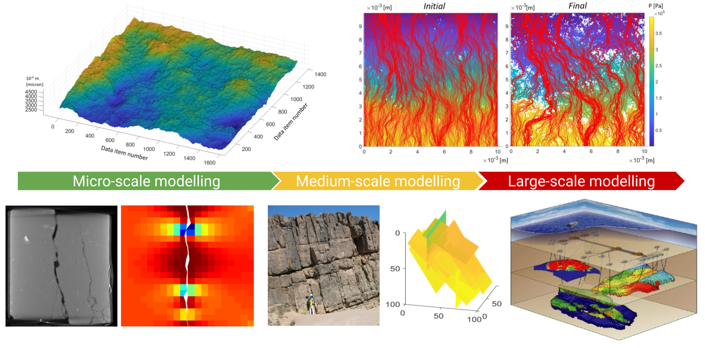 

I published it in the [Transport in Porous Media](https://link.springer.com/article/10.1007/s11242-021-01719-7), which focuses on the research on the physical and chemical aspects of the transport of mass of a fluid phase, the mass of a component of a phase, momentum and energy, in single and multiphase flow in the porous medium domain. 

## Project 9: Multi-modal data-based ML for cancer survival

Accurate modelling of the impact of patient-specific features and cancer treatments on survival allows the assignment of targeted therapy. Delivering personalized medicine to select the “best” cancer treatment for the individual is challenging. There is a need to build a multi-source data-driven model for the survival analysis of breast cancer. I developed an ML model that integrates multi-modal data - genetic, hormone, clinical, and therapy data - to predict survival for breast cancer patients. 

 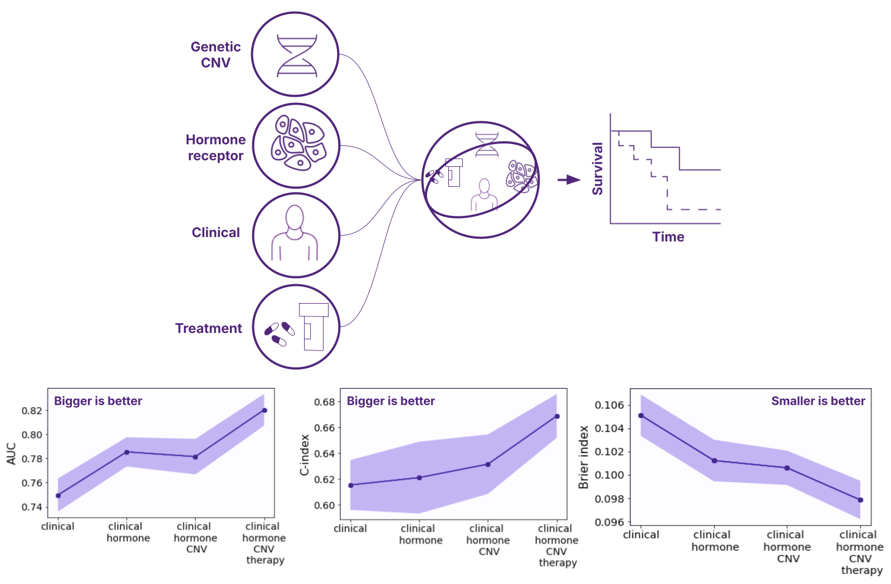 

I show that combining multi-modal data features enhances model predictive accuracy, up to AUC 0.82 on unseen test data. Results depict differential accuracy measured by a time-integrated Area Under the Curve (AUC), weighted Concordance Index and Brier index. The predictive accuracy improved stepwise by adding additional relevant data types. 

This model is part of the Integrated ML Predictor of Clinical Trials and answers questions like "What is the recommended treatment for a 52-year-old patient with stage 3 breast cancer, ER+ve, HER2-ve, genetic information e.g FGFR2 copy number gain?"

I presented it orally at the [AACR conference](https://aacrjournals.org/cancerres/article/83/7_Supplement/5696/724638/Abstract-5696-A-prognostic-machine-learning-model) in 2023, the poster is available to download [here](https://concr.co/ASSETS/files/AACR-OS-Breast-Cancer.pdf). 

## Project 10: ML to predict tissue of origin from mutation data

Cancer of Unknown Primary (CUP) is a clinical condition with a poor prognosis. Patients present with metastatic tumours for which the primary tissue of origin cannot be easily determined. The current standard of care relies on identifying the primary tissue of origin using radiological investigations, tumour marker assessment, and biopsy. For one-third of CUP patients, the origin of the primary tumour cannot be found, making it difficult to choose the best chemotherapy regime and preventing access to targeted and immune therapies. 

 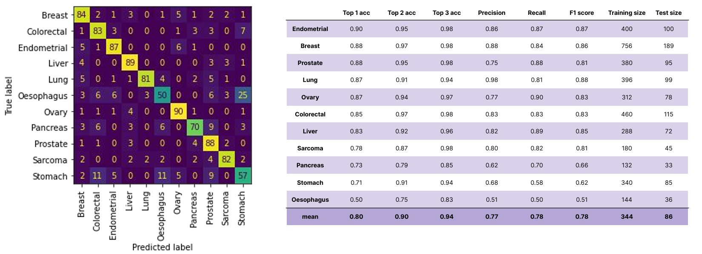 

We train a Machine Learning classifier to predict the tissue type of a solid tumour using only whole exome somatic mutation information.

We presented this study at the [AACR conference](https://aacrjournals.org/cancerres/article/83/7_Supplement/5429/719629/Abstract-5429-Using-machine-learning-to-predict), where I am the 3rd author. 

