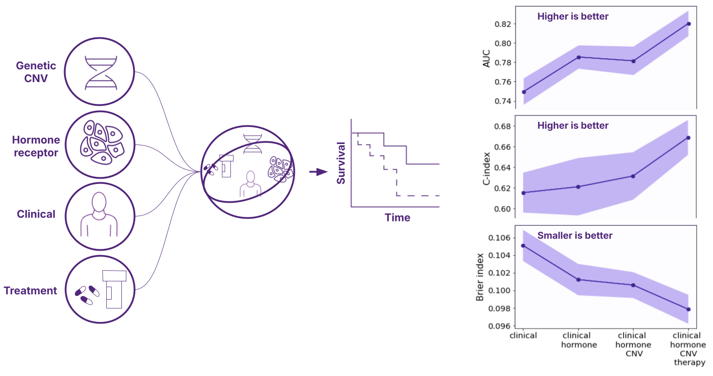

 # Portfolio - AI/ML/Computer Vision 

Hello, guys! I'm a Scientist in Machine Learning and Computational Science. Over the past 5 years, I've specialized in creating machine learning products for the biotechnology and energy industries. I love the intersection between science and real-world problems. I typically work on private repositories, but here are a few standout projects we've published. Email: 77777aidan@gmail.com

## 1) Integrated ML Predictor of Clinical Trials
We have developed a method that employs Bayesian statistics to accurately forecast the outcomes of clinical trials in the course of novel drug development. The development of an oncology drug currently incurs a cost exceeding £4 billion, given the high failure rate of approximately 95%. Our proposed Digital Twin can simulate a clinical trial and predict novel drug outcomes, thereby improving and mitigating risks in the clinical development of oncology therapeutics. 
- It uses multi-modal data: genetics (like RNAseq), clinical, image data and chemical compounds data
- We integrate XGBoost, Gaussian Process and Survival Modelling into one model
- We validate our model against past clinical trials and use standard ML validation methods 

  

## 2) Use Computer Vision to Identify Cell Types on the Medical Images 
We developed a deep-learning model to identify types of cells (tumour cells, lymphs and fibroblasts) from the medical images. The model aimed to help pathologists who spend a lot of time diagnosing cancer and help other ML models in predicting treatment outcomes. The model was trained with annotated images from a breast cancer dataset and was validated by a pathologist. The results showed that the model could accurately identify the cells, especially TILs, which it identified even better than a pathologist. 

  

We employed a U-Net architecture for semantic segmentation, training the model on the NuCLS dataset annotated for cell types. The dataset, comprising images from the TCGA for breast cancer, was split into training and validation/testing sets. The model's performance was validated by an expert pathologist, demonstrating promising results with an AUROC of 0.864 and 0.901, along with balanced and standard accuracies. The model offers a tool that can enhance precision treatment by integrating it into complex predictive modelling systems. 

## 3) Hybrid “Deep Learning + Physics” Computer Vision Model

Here, I designed and created a deep learning model that combines computer vision and physics for the physics-based simulation. Solving multi-physics problems usually requires expensive, high-performance computers and complex code. The model helps and explores how machine learning can reduce computation time in these kinds of problems. It uses a deep learning model, specifically a convolutional neural network, to predict rough fracture permeability from digital images during the fracture deformation process. Even in extrapolation tests with different fracture roughness, the model maintained high accuracy with about 8% MAPE. I show that my method is able to speed up the numerical simulation up to 20 times faster than the conventional methods.

  

## 4) Physics-based Computer Vision Method for Energy, Oil&Gas, Climate Change and Earthquakes projects

I created a research software tool (Physics-based Computer Vision Method) and methodology that takes digital images as inputs, performs predictive modelling, and identifies key performance indicators (KPIs) for energy, oil&gas and climate change projects. The model focuses on understanding and simulating how stress affects the permeability of rough fracture surfaces during the surface deformation process, using a combination of numerical contact mechanics, numerical modelling and the Stokes equation. This approach allows for the simulation of mechanical deformation and fluid flow in natural fractures with complex geometries. The software accurately predicts the stress-permeability relationship, helping to provide valuable insights for hydro-mechanical studies of geological formations. This tool significantly reduces computation time, providing quick and accurate results that can inform better decision-making in energy and climate change projects.

  

## 5) Multi-modal data-based ML for cancer survival

Accurate modelling of the impact of patient-specific features and cancer treatments on survival allows the assignment of targeted therapy. Delivering personalized medicine to select the “best” cancer treatment for the individual is challenging. There is a need to build a multi-source data-driven model for the survival analysis of breast cancer. I developed an ML model that integrates multi-modal data - genetic, hormone, clinical, and therapy data - to predict survival for breast cancer patients. 

  

I show that combining multi-modal data features enhances model predictive accuracy, up to AUC 0.82 on unseen test data. Results depict differential accuracy measured by a time-integrated Area Under the Curve (AUC), weighted Concordance Index and Brier index. The predictive accuracy improved stepwise by adding additional relevant data types. 

This model is part of the Integrated ML Predictor of Clinical Trials and answers questions like "What is the recommended treatment for a 52-year-old patient with stage 3 breast cancer, ER+ve, HER2-ve, genetic information e.g FGFR2 copy number gain?"

--------

<!---

ramm777/ramm777 is a ✨ special ✨ repository because its `README.md` (this file) appears on your GitHub profile.
You can click the Preview link to take a look at your changes.
🌱 I’m currently learning more DS to become an expert
--->

